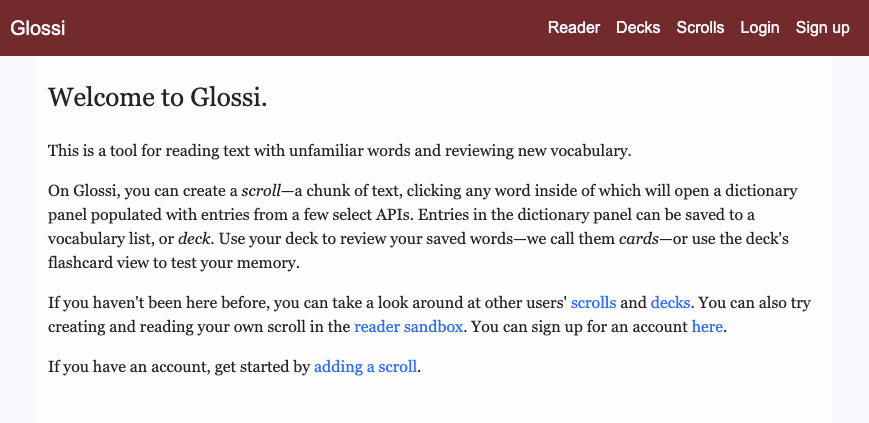
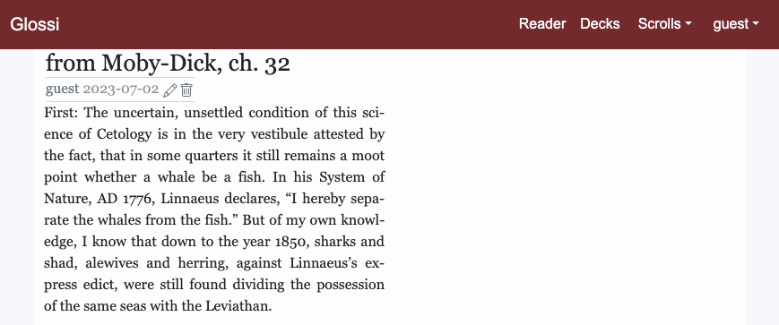
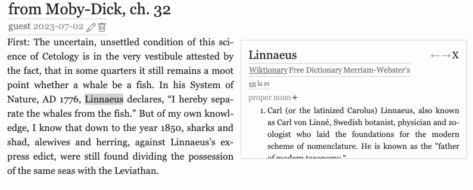
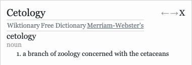
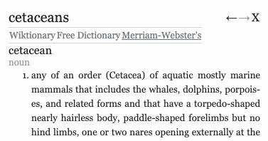
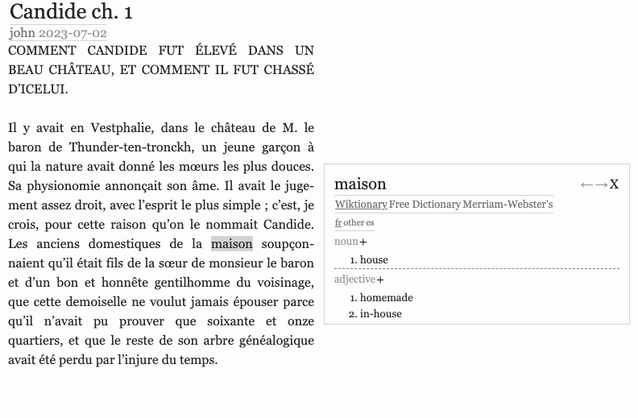
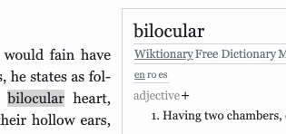
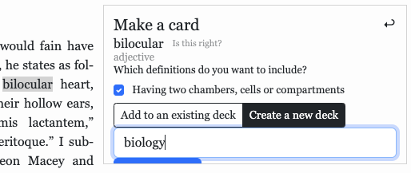
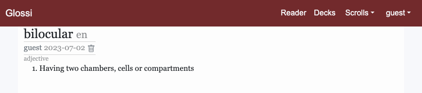
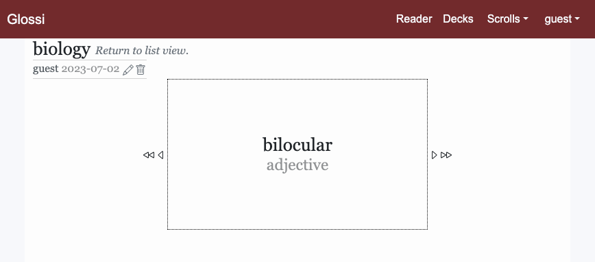

# Glossi

[Glossi](https://glossi.lat) is a web app for reading text with unfamiliar words and reviewing new vocabulary.

## Create a scroll

In Glossi, it starts with a scroll. Select and copy a chunk of text you might want to read with a dictionary on hand. Paste it in the [add scroll](https://glossi.lat/scrolls/new) form, and submit.

## Look up words in English

Clicking any word in the text triggers a dictionary look up.

Each dictionary is different from the last. Take a look by clicking one of the titles in the dictionary toolbar.

Cetology is the study of cetaceans? That's kind of circular. You could click on it to look it up.

You can also navigate through your lookup history, starting from the word that first openened the panel, using the left and right arrows.

## Look up words in other languages

While Free Dictionary and Merriam-Webster's Collegiate Dictionary only have English words, Wiktionary will provide matches from any language. The language toolbar, located just below the dictionary toolbar when Wiktionary is open, contains the ISO language code of every language that has a match for your look up.

*Note: At this time, Glossi provides limited support for looking up non-Latin scripts. The degree of this limitation varies with the language and the script: Greek is well-supported, Russian not so much, and Chinese is not supported at all. Apologies for this. In a later version I'd like to have look ups available in every script and language.*

## Save a word for review

Glossi has a cardmaking feature that lets you save words for later review.

Create a card by selecting an entry from the dictionary panel. Click on the addition sign beside the part of speech label to open up the form for making a card, then toggle the definitions you want to include.

## Saving a card to a deck

When you create a card, you will choose to add it to an existing deck or to create a new one.

Cards must be saved to a deck. When you create an account on Glossi, a new deck is automatically created for you.

<!-- *Note: Cards are intended for reviewing specific meanings of a word. Instead of each and every definition associated with a word, a card should contain definitions related to just one entry. For example, consider the word "fly". Is it a bug, is it what birds and airplanes do, or is it slang for "fashionable"? A card should cover only one of those meanings.* -->

After that, your card is created!

## Viewing cards

To view a card, navigate to the decks index, and select the deck that contains the card you're looking for. By default, your deck presents your cards in list view. Scroll until see you the preview for the card you're looking for and click on it.

You can also quiz yourself on the cards you've created. On the deck page, click "Enter flashcard view" beside the deck name. You will then be able to cycle through your cards, seeing first the card's title and part of speech, then its definitions.

