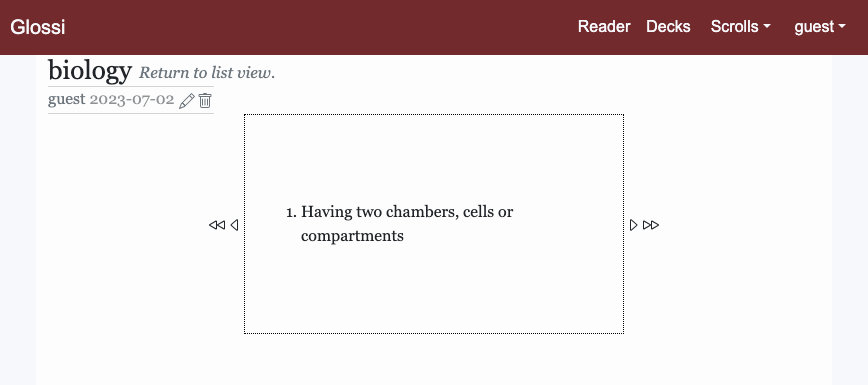

# Glossi

[Glossi](https://glossi.lat) is a web app for reading text with unfamiliar words and reviewing new vocabulary.

## Getting started

In Glossi, it starts with a scroll. Choose a chunk of text you might want to read with a dictionary on hand. Paste it into the [add scroll form](https://glossi.lat/scrolls/new), and submit.

Now you can click on any word in the passage to look it up on the dictionaries.

You can also click on a dictionary subheading to see what one of the other dictionaries has to say about a word.

Click on a word in the definition to view that word's entries in the dictionary panel. For example, clicking on "cetaceans" in the above would lead to this panel:

To return to the view for the previous word, click the left-facing arrow in the top right hand corner of the panel. You can navigate through your lookup history, starting from the word that first openened the panel, using the left and right arrows.

Free Dictionary and Merriam-Webster's Collegiate Dictionary only have English words. While it may sometimes surprise what's recorded in the English dictionary, Wiktionary is a great resource for viewing meanings of the same word—or the same collocation of letters—in different languages. The language bar has abbreviations for languages available for a given word.

Besides reading texts, Glossi can also be used to save words ou want to review. Words are saved to decks. To save a word to a deck, you first need to create it as a card.

Cards can be created by selecting an entry from the dictionary panel. Click on the addition sign beside the part of speech label to open up the form for making a card.

Then toggle the definitions you want to include a card. You will also choose to add the card to one your exisiting decks, or to create a new one.

After that, your card is created!

One more thing: when viewing a deck, you can choose between list view and flashcard view. List view is like a normal posts index; with flashcard view, you you view your cards one by one, first the title, then the the definitions.

